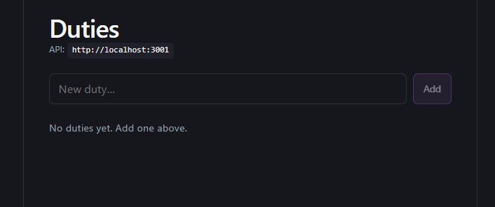
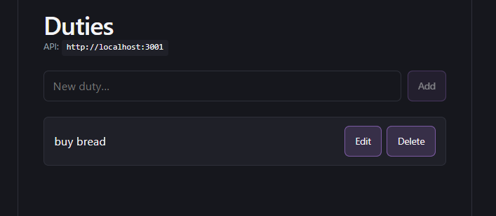
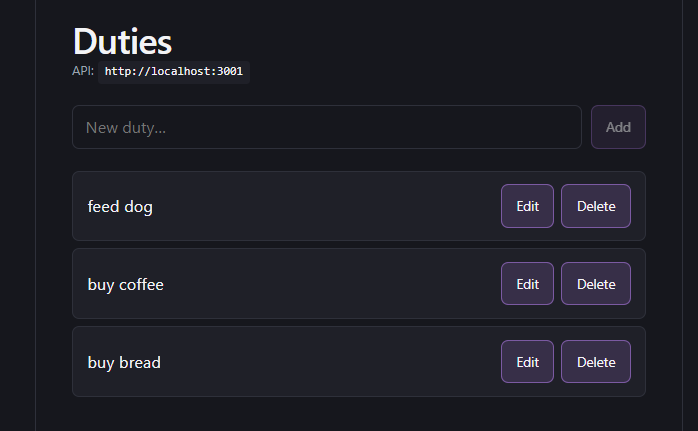
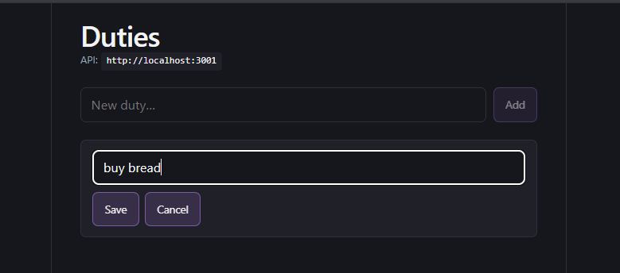

# todo-list

## Backend

### Requirements

- Node.js
- Docker (for PostgreSQL)

### Installation

From the `backend` folder:

```bash
cd backend
npm install
```

Create `.env` from the template (connection settings for Postgres):

```bash
cp .env.example .env
```

Start the database and apply the schema:

```bash
docker compose up -d
npm run db:init
```

### Running

```bash
npm run dev
```

### Tests

```bash
npm run test
```

### Build

```bash
npm run build
```

### Endpoints

| Method | Endpoint | Description |
| --- | --- | --- |
| GET | /health | Health check |
| GET | /duties | Get all duties | 
| POST | /duties | Create a new duty |
| PUT | /duties/:id | Update a duty by id |
| DELETE | /duties/:id | Delete a duty by id |

#### curl examples

##### Health check
```bash
curl http://localhost:3001/health
```

##### Create
```bash
curl -s -X POST http://localhost:3001/duties \
  -H "Content-Type: application/json" \
  -d "{\"name\": \"Test task\"}"
```

##### List
```bash
curl -s http://localhost:3001/duties
```

##### Update
```bash
curl -s -X PUT http://localhost:3001/duties/DUTY_ID \
  -H "Content-Type: application/json" \
  -d "{\"name\": \"Updated name\"}"
```

##### Delete
```bash
curl -s -X DELETE http://localhost:3001/duties/DUTY_ID -w "\nHTTP %{http_code}\n"
```

### Database

Access to the container: 
```bash
docker exec -it todo-list-db psql -U todo -d todo_list
```

Then inside psql:
```bash
\dt                    -- list tables
SELECT * FROM duties;  -- see rows
\q                     -- quit
```

## Frontend

### Requirements

- Node.js
- NPM

### Installation

From the `frontend` folder:

```bash
cd frontend
npm install
```

Create `.env` from the template (backend URL for the API client):

```bash
cp .env.example .env
```

### Running

```bash
npm run dev
```

### Tests

```bash
npm run test
```     

### Build

```bash
npm run build
```

## Screenshots

### Empty state


### One duty


### Many duties


### Edit duty


